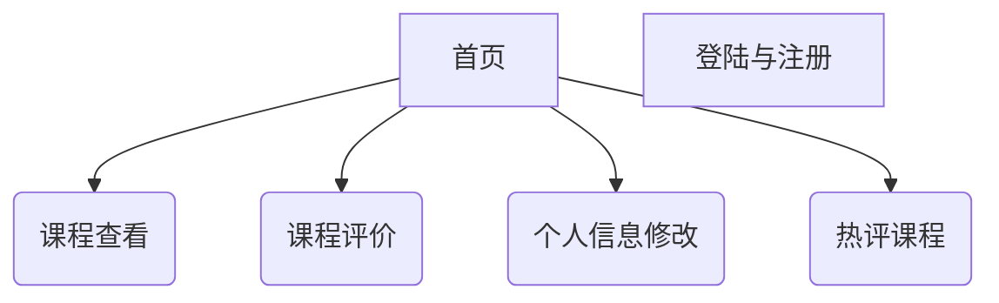

# 需求分析文档—— 海大优选

## 1.引言

1. **编写目的**
   
   ​	本报告的主要作用是确定各个项目模块的开发情况和主要的负责人，供各项模块的负责人阅读，做到及时协调，按步有序进行项目的开发。减少开发中的不必要损失。具体步骤：拟定开发计划书，分配项目工作，安排项目进度。
   
   ​	计划对象：软件工程第15小组。
   
   ​	小组成员：杨志豪，曾哲，张鹏，任峥，韩晓，贺升燃。
   
2. **项目背景**
   
   ​	开发网站名称：海大优选
   
   ​	项目内容来源：软件工程课程所提及项目之一
   
   ​	项目开发者：软件工程第15小组
   
   ​	用户：海大计算机专业学生
   
   ​	实现方式：网页
   
3. **定义**：为用户提供课程评价的平台

4. **参考资料**：无

## 2.任务概述

1.**目标**

​	致力于开发一个功能健全，用户体验良好的评课网站，以期达到如下功能：网站以课程信息和评价的方式展示在页面，并接受大家对课程的评价和查看的平台。

2.**运行环境**

​	操作系统：目前市场上主流操作系统。

​	支持环境：

​	开发工具：

## 3.功能需求

1.**对功能的规定**

| 未注册用户                                                   | 注册用户                                                     |
| :----------------------------------------------------------- | ------------------------------------------------------------ |
| 1.可以进入登陆界面。 2.可以进入注册界面。 2.无法进入主界面。 | 1.可以进入登陆界面。 2.可以进入主界面。 3.可以进入个人信息界面。 4.可以查看课程。 5.可以评价课程。 6.可以修改个人信息。 |

2.**目录设置**

3.**栏目设置**

​	栏目设有：主界面导航栏

4.**各功能模块详解**

| 用户登陆界面                               | 用户注册界面                           |
| ------------------------------------------ | -------------------------------------- |
| 账号，密码，登录按钮                       | 用户名，真实姓名，学号，密码，确认密码 |
| **用户个人信息界面**                       | **课程基本信息**                       |
| 用户名，用户ID，真实姓名，学号，专业，密码 | 课程名称，课程ID                       |
| **课程总体评价**                           | **评价信息**                           |
| 评价分数及星数，评价总人数，               | 评分，评价字数，评价人ID               |

## ***4.接口需求***

1.**用户接口需求**

2.**硬件接口需求**

3.**软件接口需求**

## ***5.性能需求***

1.**数据精确度**

2.**时间特性**

3.**适应性**

